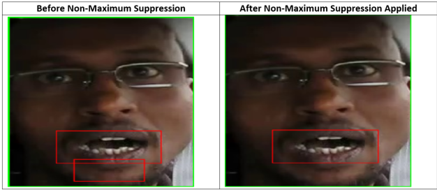

# Detecting Driver Drowsiness using Deep Learning Techniques

Alex Link

## Abstract

Driver drowsiness is one of the leading causes of motor vehicle crashes
with approximately 25% incidences being sleep related. Several solutions
have been implemented to detect driver drowsiness. This paper will
explore how computer vision approaches in line with deep learning
techniques have provided efficient solutions to the problem. The driver
drowsiness detection system uses Python, Open CV and CV Lib to detect
drowsiness using facial landmarks (eyes and mouth) of driver images. CNN
architectures such as ResNet 50, Inception V3 and a custom-built CNN
were implemented to evaluate the drowsiness system. The ResNet 50 model
had the highest validation accuracy (97.34%) for the image input
compared to the other architectures.

## Introduction and Motivation

According to the 9th International Conference on Ambient Systems,
Networks, and Technologies (ANT 2018), "Driver drowsiness is one of the
leading causes of motor vehicle crashes. This was confirmed by a study
conducted by the AAA Foundation for Traffic Safety, which showed that
23.5% of all automobile crashes recorded in the United States in 2015
were sleep-related: 16.5% for fatal crashes and 7% for non-fatal
crashes." Motivation was drawn from the fact that driver drowsiness is
the leading cause of motor vehicle crashes. The goal was to explore deep
learning techniques that could be implemented to detect driver
drowsiness to help reduce the number of motor vehicle crashes.

According to an article presented at the Ambient Systems, Networks and
Technologies Conference, several approaches to tackle the problem have
been proposed to increase accurateness and accelerate drowsiness
detection. Driving patterns could be analyzed using vehicle
characteristics, road conditions and driving skills, which all have
calculations associated with them. Example, driving patterns can be
calculated using deviations from lateral or lane position/steering wheel
movements. Increased deviations may suggest low levels of alertness,
high levels of drowsiness. Additionally, Electrocardiogram and
Electroencephalogram data can be used. This data is gathered from
physiological sensors which provide information about the brain\'s
activity, and thus could be used to detect driver drowsiness. Research
shows that this method is the most accurate with accuracy rates over
90%. Only issue is that drivers would be required to wear several sensor
wires during testing periods.

One popular and common technique is computer vision which is based on
facial feature extraction. It uses behaviors such as facial expression,
yawning duration, head movement, and eye closure. This method measures
drowsiness through the distance between eyelids and mouth behaviors.
Research shows that an increased number of blinks is associated with an
increased sense of drowsiness. Same applies for increased mouth
movements (yawns). Facial expressions have the ability to provide
insights into the physiological conditions of the body for example in
our case, 'drowsiness'. Drowsiness in humans is characterized by facial
expression movements such as eyes closing, mouth yawning, tilting of the
neck and sometimes the dropping of the jaw. This paper will focus on
tracking the shutting of eyes and mouth yawns to detect drowsiness and
classify the drivers as drowsy. The input images were obtained from a
Kaggle dataset which were then split into two classes; awake or drowsy.
Closed eyes and opened mouth (yawn) indicated driver drowsiness. Opened
eyes and a closed mouth indicated the driver was alert/awake. The
software used for this study included Python, OpenCV, Dlib, MTCNN and
CVLib. The CVLib library was used to train the facial landmarks where
the landmark features were extracted from the pictures to help classify
the driver\'s state of drowsiness. (See figure below).

*Figure 1: Drowsiness Detection using CV-Lib*  
*****{images of people yawning versus a closed mouth}*****

## Literature Review:

We conducted some research on the project idea and what past researchers
have investigated to help the problem at stake. We explored the article
([[https://arxiv.org/pdf/1811.01627.pdf]](https://arxiv.org/pdf/1811.01627.pdf))
presented at the Ambient Systems, Networks and Technologies Conference.

In a bid to increase accurateness and accelerate drowsiness detection,
several approaches have been proposed. This section attempts to
summarize previous methods and approaches to drowsiness detection.

Past studies have approached this problem by analyzing driving patterns
using vehicle characteristics, road conditions, driving skills as
parameters. Each of the parameters has a calculation associated with
them. For example, driving patterns have been calculated using the
deviations from lateral or lane position/steering wheel movements.
Increased deviations may suggest low levels of alertness, high levels of
drowsiness.

Additionally, Electrocardiogram and Electroencephalogram data can be
used. This data is gathered from physiological sensors which provide
information about the brain\'s activity, and thus could be used to
detect driver drowsiness. Research shows that this method is the most
accurate with accuracy rates over 90%. Only issue is that drivers would
be required to wear several sensor wires during testing periods.

One of the other common techniques is computer vision which is based on
facial feature extraction. It uses behaviors such as facial expression,
yawning duration, head movement, and eye closure. This method measures
drowsiness through the distance between eyelids and also mouth
behaviors. Research shows that an increased number of blinks is
associated with an increased sense of drowsiness. Same applies for
increased mouth movements (yawns). The paper goes on to state that deep
learning approaches, especially the Convolutional Neural Networks (CNNs)
method, have gained prominence in resolving challenging classifications
problems.

### The CNN Method Approach:

After exploring the possible methods previous studies have used, we
opted to approach this problem using the Convolutional Neural Network.
We felt we would benefit from this method/approach as our problem
formulation involves an image-based approach. To further explore this
method, we came across a similar research conducted in 2020. (Source:
[[https://www.hindawi.com/journals/cin/2020/7251280/#conflicts-of-interest]](https://www.hindawi.com/journals/cin/2020/7251280/#conflicts-of-interest))

The study approached the problem using an image classification approach,
where a driver fatigue detection algorithm using driving images was
formed. A Multitask Cascaded Convolutional Network (MTCNN) was used in
face detection and feature point location, where the region of interest
was extracted using feature points. To detect the state of eyes and
mouth from the region of interest images, the convolutional neural
network was used. The two parameters used for driver drowsiness
detection were the state of eyelid closures and mouth openings.

The steps conducted to achieve the above were as follows:

1)  <ins>Face detection and feature point location</ins>

> 
>
> A proposal network was the first step where images of different sizes
> are obtained and then put into a network in sequence. A CNN is then
> employed to determine whether the face is included in the 12\*12 area,
> obtaining a box of the participants face area. This face area is then
> calibrated using the frame regression vector and suppressed to
> eliminate overlapping face regions.
>
> 
>
> The refined network takes the candidate face area from the proposal
> network and adjusts the image size. It is screened by the bounding box
> regression and a connection layer is added to obtain a more accurate
> face position.
>
> 
>
> Lastly, the output adjusts the image size to a 48\*48. The face in the
> image is screened to obtain a final face position and the feature
> points of interest (eyes, mouth, nose). See below final face positions
> indicated in blue squares from the entire image.
>
> 
>
2)  <ins>State of eye and mouth recognition</ins>
>
> A two-eye image was used to determine whether participants\' eyes were
> open or closed. The position of the driver's left and right eye was
> obtained using the MTCNN:
>
> 
>
> Left eye position here is x1, y1 while the right eye position is x2, y2.
> Distance between the eyes is d1. Width of the eye image is w1. Height is
> h1. Similarly, the distance and position of the mouth is measured using
> the following formula:
>
>
>
> The position of the left corner of the mouth is x3, y3, and the position
> of the right corner of the mouth is x4, y4. The distance between the
> left and right corners is d2, the width of the mouth image is w2, and
> the height is h2.

## <ins>EM-CNN architecture used</ins>

The architecture used was an eye mouth, convolutional neural network to
determine whether a) the eyes of the driver are open or closed, (b)
whether the mouth is open or closed, and ultimately whether the driver
is awake or sleepy.

Here we see that the images of the driver (input image) is adjusted to
175\*175 to account for a real driving environment. A feature map was
obtained via two convolutional pools with a 3\*3 convolutional layer,
step size=1, and a 3\*3 pooled-layer, step size=2. Next, a layer of
pixels is filled along the image edges before the convolution operation.
This is to ensure that there is no information loss and reduction of the
output image size. The convolution layers are the top right of the
image, and the pooling layers are used to increase the adaptability of
the network to the size. Another pooling is undergone to obtain a 44\*44
feature map. After this the image goes through three layers of
convolution and then is pooled. This results in the 11\*11\*72 feature
map which is then converted to a 1-D vector in the fully connected
layer. Once fully connected, the classification result is output using
softmax. Classification results indicate whether the eyes and/or mouth
are open or closed.

## <ins>Fatigue state detection:</ins>

The study then went on to calculate the fatigue state of the driver
using eye closure and mouth opening degrees. These were obtained using
PERCLOS (percentage of eye closure time per unit time) and POM
(percentage of mouth closure time per unit time) respectively.

f1=closed frame of eye

Sigma function=total number of closed eye frames per unit time

N= total number of frames per unit time

When PERCLOS is greater than 0.25 then the driver is in the closed eye
state for a long time indicating drowsiness.

f1=frame of mouth open

Sigma function=total number of mouth opening frames per unit time

N= total number of frames per unit time

When POM is greater than 0.50 then the driver is in the mouth opening
state for a long time indicating drowsiness.

Once this is complete then the drowsiness state is identified based on
the thresholds obtained. The face and feature point positions in the
frame image are obtained using the MT-CNN, and the region of interest of
the eyes and mouth is extracted. Then the state of the eyes and mouth
are determined using the EM-CNN and the driver is then determined to be
in a drowsy state or not.

In terms of data collection, the authors collected a total of 4000
images. These were split into four categories, i.e., open eyes (2226
images; 1558 training and 668 test samples), closed eyes (1774 images;
1242 training and 532 test samples), open mouth (1996 images; 1397
training and 599 test samples), and closed mouth (2004 images; 1,403
training and 601 test samples).

## Dataset

As stated above, our collection of images was originally obtained from
Kaggle, where it was initially stored in four directories, containing
approximately the same number of images (725), which were labeled as
*Closed, Open, no_yawn* and *yawn*. For the purpose of this experiment,
since we were most interested in classifying individuals as drowsy or
awake, these directories were moved into subdirectories and labeled as
follows; *Open* and *no_yawn* as *awake* and *Closed* and *yawn* as
*drowsy*. The *Open* and *Closed* images were that of close up, centered
images of eyes, whereas the *no_yawn* and *yawn* images were of
individuals sitting in their cars, taken at various angles and at
different orientations within the images boundaries (i.e. some images
were frontal views of people, with their faces centered in the images,
and others were taken from an angle and had individuals aligned to the
left or right side of the image frame). These images would be further
pre-processed in the hopes of making our model more robust, utilizing a
variety of techniques discussed in more detail below.

## Method and Experiments

For our initial approach to this problem, we decided to utilize transfer
learning to establish a "baseline" model for future comparison. This
baseline approach included training a ResNet50 pre-trained imagenet
model (which was chosen due to our previous successes using this model
in prior assignments) on the original Kaggle images with no
pre-processing applied. Ultimately, this model obtained a training
accuracy of 0.9940 and a validation accuracy of 0.9672. After
establishing these baseline metrics, the images were pre-processed in
hopes of improving on these accuracy scores. Upon further exploration of
the *yawn* and *no_yawn* images, we noticed they contained quite a bit
of background imagery, such as other internal parts of the vehicle or
the environment outside the driver's window; features that are not
relevant towards determining whether the driver is drowsy or alert. To
address this issue, we decided to implement facial detection, to first
locate the individual's face within the image, then draw a bounding box
around it and crop the image along this bounding box to minimize the
potential for the model to train on the background scenery within the
images.

Four landmark facial detector methods were explored to see which one
would give a high number of true positives. Given the problem of motor
vehicle crashes due to driver drowsiness a high number of true positives
would be beneficial. The methods experimented with included: Haar
Cascade XML files for face detection, dlib, Multi-task Cascaded
Convolutional Neural Network (MTCNN) and CVLib's face detection
function. We first began by implementing Haar Cascades, chiefly their
default frontal face and profile face XML files, but after tuning
various parameters, such as the scaling factor and minimum neighbors
arguments, we found this to be the worst of our chosen methods, as not
only did it produce the least number of true positives, but it also
created the most false positives (i.e. bounding boxes where faces were
not located). We found the dlib and MTCNN methods produced a higher
number of true positives almost no false positives compared to the Haar
Cascades, however, there were still a significant number of images in
which they did not detect any faces at all; primarily those containing
faces that were at significantly distinct angles. Ultimately, we
stumbled upon the open-source CVLib library, which provided a face
detection function that utilized OpenCV's DNN module with a pre-trained
caffemodel to detect faces. It had the highest number of true positives
and also detected faces at a number of angles that the others did not;
the only images it did not perform well on were those in which the
individual's facial features were not very distinguishable, particularly
those with more round faces, where their chin was not easily discernible
(even to the human eye). Once we had settled on our facial detector, we
applied it to all the *yawn* and *no_yawn* images in our dataset, drew
bounding boxes around the images and cropped the area outside of these
boundaries.

After drawing these bounding boxes, we wanted to draw additional
attention to other possible indicators of drowsiness, so we further
experimented with detecting facial features within these facial bounding
boxes, specifically the mouth and eyes. After examining the images
further, we noticed somewhat conflicting indicators when it came to the
eyes and their corresponding *drowsy* and *awake* labels. Many of the
individuals yawning had open eyes, while some of those with closed
mouths had their eyes closed. As we already had an equal number of close
up images of eyes that were appropriately labeled as *awake* (open) and
*drowsy* (closed), we decided to focus the attention on the individuals'
mouths, as they were all labeled correctly. To do this, we utilized the
Haar Cascade Smile XML file to detect mouths within the boundaries of
our already detected facial bounding boxes (to ensure objects that
definitely were not mouths outside of peoples' faces were not
incorrectly identified as mouths). Utilizing this method, we were able
to detect mouths on individuals' faces fairly accurately, however, one
issue we ran into was the detection of multiple "mouths" (bounding boxes
over different parts of the same mouth) in the same vicinity, leading to
multiple bounding boxes overlapping each other. To address this problem,
we came across the process of non-maximum suppression, which removes
redundant bounding boxes with an overlap greater than a specified
threshold. After implementing this method and setting a low overlap
threshold (10%), we saw a significant increase in our true positive
mouth detection, as seen in the example below.

   

These mouth images were then also cropped along their bounding boxes,
and each image (including the full facial images) was then resized and
labeled appropriately (0 for *drowsy*; 1 for *awake*) to be used for
training. Since all of our eye images were close up images of individual
eyeballs, each centered within the image and clearly either open or
closed (we did not see any with eyelids half closed to potentially
indicate drowsiness), the only preprocessing we applied to these images
was resizing and appropriate labeling. After combining all of our
preprocessed data together, it was split into training and validation
sets (80/20 split), and the training set was further augmented with some
additional features of Keras' ImageDataGenerator, such as allowing for
random zooming (0.2), horizontal flipping and image rotation (30
degrees), to help prevent any additional overfitting before finally
fitting our models.

## Models and Results

Three additional models were built in addition to our previous baseline;
one original architecture not utilizing any transfer learning, and then
two which did use pre-trained models for their base layers. The first
was a custom CNN model built with twelve layers, composed of four
convolutional layers, four max pooling layers, a flatten and drop out
layer, and finally two dense fully-connected layers, of 64 units (ReLu
activation) and 2 units (Softmax activation), respectively. Our two
transfer learning models were built using a ResNet-50 CNN base layer
(with the preprocessed images as opposed to our baseline) and an
Inception V3 CNN base layer. An additional two layers, global average
pooling and a fully connected layer, were added to our transfer learning
models.

Sparse categorical cross-entropy was utilized for our loss function (as
our data was in labeled integer format), and accuracy was the metric we
used to evaluate the performance of these architectures. The table below
shows the training and validation accuracy of each of the architectures
we used. Our results showed that the ResNet-50 model with preprocessing
had the highest validation accuracy rate with the custom CNN having the
lowest.

  ----------------------- ------------------------ -----------------------
<table width="482" align="center">
<tbody>
<tr>
<td width="158">

<strong>Model</strong>

</td>
<td width="166">

<strong>Training Accuracy</strong>

</td>
<td width="158">

<strong>Validation Accuracy</strong>

</td>
</tr>
<tr>
<td width="158">

ResNet 50 (Baseline)

</td>
<td width="166">

.9940

</td>
<td width="158">

.9672

</td>
</tr>
<tr>
<td width="158">

Custom CNN

</td>
<td width="166">

.8701

</td>
<td width="158">

.8826

</td>
</tr>
<tr>
<td width="158">

ResNet 50

</td>
<td width="166">

.9692

</td>
<td width="158">

.9734

</td>
</tr>
<tr>
<td width="158">

Inception V3

</td>
<td width="166">

.9586

</td>
<td width="158">

.9556

</td>
</tr>
</tbody>
</table>

  ----------------------- ------------------------ -----------------------

**Inception V3** **ResNet 50 with
Pre-Processing**{width="2.776042213473316in"
height="3.4812456255468067in"}{width="2.7031255468066493in"
height="3.5420253718285215in"}

The plots above show us the training and validation accuracies and loss
for the pre-trained Inception V3 and ResNet 50 architectures. As the
number of epochs increase we see a decrease in both the training and
validation losses for both architectures, but a significant drop in the
ResNet 50 architecture. Simultaneously, we see an increase in both the
training and validation accuracies.

## Conclusion and Future Work

Given our above results, the best approach for addressing our given
problem appears to be applying a transfer learning approach, as these
models performed best, and rather similarly; all achieving training and
validation accuracies of over 95%, while our custom CNN failed to reach
even a 90% accuracy level on either dataset. However, given more time
and resources, there are a few more things we would have liked to
experiment with in hopes of improving upon these scores. For instance,
when the minimum neighbors parameter of our feature detection exceeded a
value of 9, our Colab session ran out of memory and the session was
terminated. Perhaps with more available computing power, the windows of
our feature detection would be able to detect features more accurately.
Subsequently, we looked into possibly developing our own haar cascade
XML file to more accurately detect certain faces, such as those of more
rotund individuals with less distinguishable features, such as chins
that were not easily discernible. Unfortunately, it appeared the process
for this would have involved quite a bit of image collection (we found
one source recommending 50,000 positive images and 25,000 negative
images to create a file that would improve upon the already established
haar cascades), and we found we did not have the time or computing power
to do this. Additionally, given more time we would have liked to
experiment with the custom CNN layers more, as we only utilized twelve
layers, while the base layers of the pretrained models alone contained
50 (ResNet-50) and 48 (Inception V3) layers. We believe increasing the
depth of the custom CNN layers would certainly have improved the
accuracy, and it is something we look forward to testing even after this
class ends. Even if we cannot improve upon the accuracy of one of the
transfer learning models, we find solace in the fact that we know they
are always available to serve as launching points for future work we may
conduct in deep learning.

## 

## 

## References

"Driver Drowsiness Detection System with OpenCV & Keras." DataFlair, 4
July 2021,
https://data-flair.training/blogs/python-project-driver-drowsiness-detection-system/.

Jabbar, Rateb, et al. "Real-Time Driver Drowsiness Detection for Android
Application Using Deep Neural Networks Techniques." Procedia Computer
Science, vol. 130, 2018, pp. 400--407.,
https://doi.org/10.1016/j.procs.2018.04.060.

Zhao, Zuopeng, et al. "Driver Fatigue Detection Based on Convolutional
Neural Networks Using EM-CNN." Computational Intelligence and
Neuroscience, Hindawi, 18 Nov. 2020,
https://www.hindawi.com/journals/cin/2020/7251280/#experimental-results.

Zhong, Grant. "Drowsiness Detection with Machine Learning." Medium,
Towards Data Science, 10 June 2021,
https://towardsdatascience.com/drowsiness-detection-with-machine-learning-765a16ca208a.
